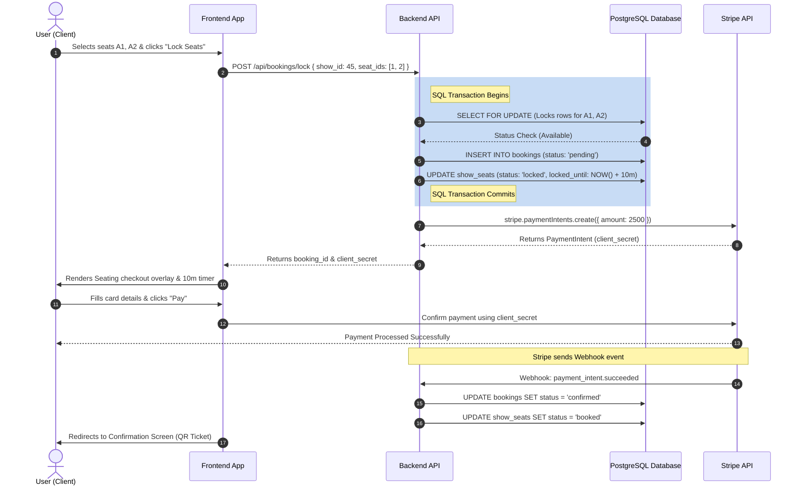

# Frontend UI Design & User Flow Plan

This document maps out the User Interface (UI) requirements, page layouts, integration with backend APIs, and step-by-step user flows for the Movie Ticket Booking platform.

---

## 1. Required Screens & Key Workflows

### 1.1 Home / Movie List Screen
*   **Purpose**: Browsing and searching active movies.
*   **API Integrations**: 
    *   `GET /api/movies` (Fetches movie lists, supports search and pagination)
*   **UI Components**:
    *   **Hero Section**: Prominent banner for featured films with high-quality backdrop artwork.
    *   **Search Bar**: Dynamic searching by movie title.
    *   **Movie Grid**: Cards containing:
        *   Movie poster image
        *   Title and genre badges
        *   Duration (mins)
        *   "Book Tickets" Action Button
*   **User Action**: Clicking "Book Tickets" redirects to the **Movie Details & Showtimes** screen.

---

### 1.2 Movie Details & Showtimes Screen
*   **Purpose**: Display movie synopsis and date-based showtimes.
*   **API Integrations**:
    *   `GET /api/movies/:id` (To load specific movie metadata)
    *   `GET /api/shows?movie_id=X&date=YYYY-MM-DD` (To retrieve shows for a selected date)
*   **UI Components**:
    *   **Backdrop Header**: Blurred poster image behind movie details (synopsis, cast, release date).
    *   **Horizontal Date Picker**: A scrollable horizontal bar showing dates (e.g., Today, Tomorrow, and the next 5 days).
    *   **Showtimes Grid**: Grouped by screen type (e.g., "Screen 1 - IMAX", "Screen 2 - Dolby Cinema"). Interactive buttons displaying start times (e.g., "14:30", "18:00").
*   **User Action**: Clicking an available showtime button redirects to the **Seat Selection** screen.

---

### 1.3 Seating Layout & Real-Time Lock Screen
*   **Purpose**: Interactive seat selection with a 10-minute temporary checkout lock.
*   **API Integrations**:
    *   `GET /api/shows/:id/seats` (Loads current seat layout and availability)
    *   `POST /api/bookings/lock` (Locks selected seats and creates a pending booking)
*   **UI Components**:
    *   **Screen Arch**: Virtual curved projection screen indicator at the top to give a physical orientation sense.
    *   **Interactive Grid**: Visual representation of seats.
        *   *White/Green*: Available Standard/Premium seats.
        *   *Blue*: Currently selected seats (user click).
        *   *Grey*: Booked (Sold out).
        *   *Orange/Lock Icon*: Seats locked by other users (temporarily unavailable).
    *   **Legend**: Status key explaining color codes.
    *   **Seating Summary Card (Overlay)**: Displays:
        *   Selected seat numbers (e.g., "Row C - 4, 5")
        *   Total price calculation
        *   A 10-minute countdown timer (triggers once `POST /api/bookings/lock` succeeds).
*   **User Action**: Selecting seats and clicking "Proceed to Checkout" triggers the lock request. On success, it redirects to the **Payment Gateway** screen with the booking details and Stripe `clientSecret`.

---

### 1.4 Checkout & Stripe Payment Screen
*   **Purpose**: Complete secure card payment within the active 10-minute lock window.
*   **API Integrations**:
    *   Stripe SDK Integration (via Stripe Elements / React-Stripe)
*   **UI Components**:
    *   **Active Expiry Timer**: Prominently displayed countdown warning (e.g., "08:45 left to pay").
    *   **Checkout Summary**: Lists show details, seat selection, and total price.
    *   **Stripe Card Element**: Input fields for Card Number, Expiry, CVC, and ZIP code.
    *   **Action Buttons**: "Pay Now" and "Go Back" (releases lock).
*   **User Action**: Completing the card form and clicking "Pay Now". On payment confirmation, Stripe redirects to the **Booking Confirmation** screen. If the timer hits zero, the screen displays a "Lock Expired" modal and redirects back to Seating.

---

### 1.5 Booking Confirmation Screen
*   **Purpose**: Confirmation invoice showing details and digital entry pass.
*   **API Integrations**: None (State passed via route context on payment success).
*   **UI Components**:
    *   **Success Indicator**: Premium green micro-animation checkmark.
    *   **Digital Ticket Invoice**: 
        *   Ticket QR Code (or barcode) for entry scanner.
        *   Booking ID and Movie Details.
        *   Showtime, Screen Name, and Seat IDs.
        *   Payment receipt total.
    *   **Action Buttons**: "View My Bookings" and "Go to Home".

---

### 1.6 User Dashboard / Booking History & Cancellation Screen
*   **Purpose**: View profile, history of bookings, and handle refunds.
*   **API Integrations**:
    *   `GET /api/bookings/history` (Fetches booking list)
    *   `POST /api/bookings/:id/cancel` (Triggers booking cancellation & Stripe refund)
*   **UI Components**:
    *   **Status Tabs**: Filter list by "Upcoming" and "Past/Cancelled" bookings.
    *   **Booking Cards**: Displays ticket details.
        *   If the booking status is `confirmed` and current time is > 2 hours before showtime, display a **"Cancel Booking"** button.
        *   Display statuses clearly (`confirmed`, `pending_payment`, `cancelled`, `expired`).
    *   **Cancellation Modal**: Warns the user about refund timelines. On confirmation, calls the cancel API and refreshes the booking list.

---

## 2. Seating Selection & Payment User Flow

