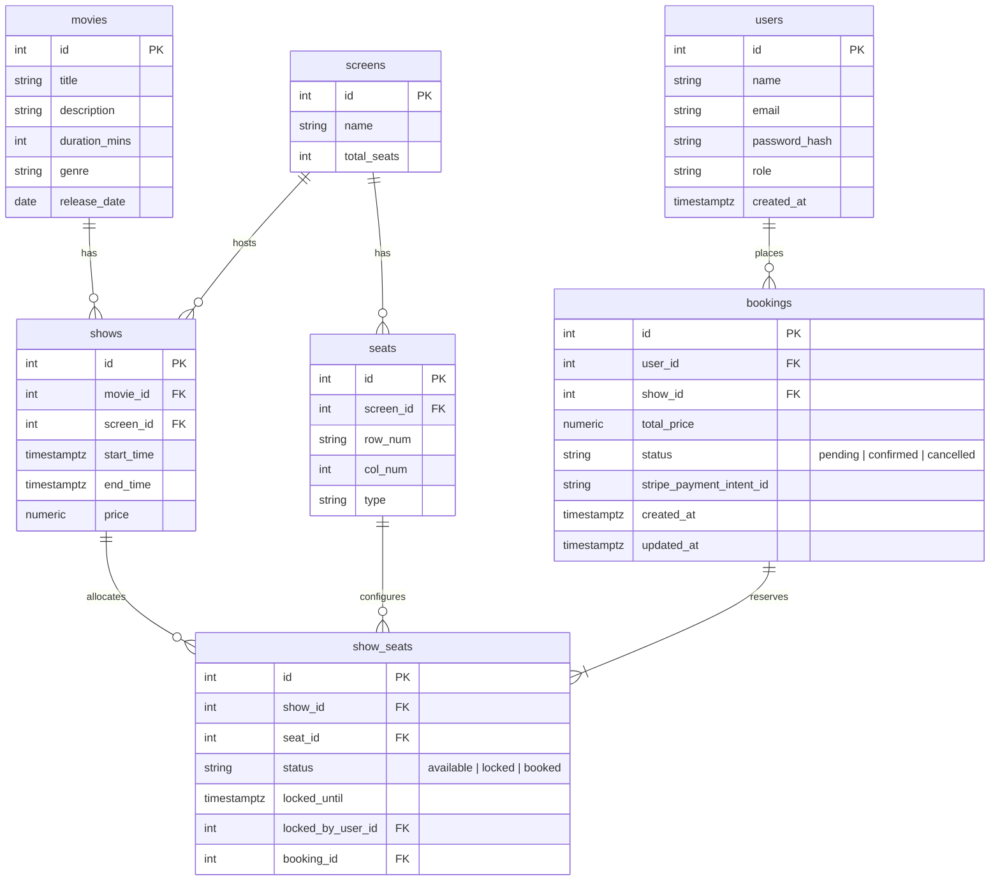

# Implementation Plan - Movie Ticket Booking Platform

This plan outlines the roadmap to transition our existing database-backed Node.js/Express application from User & Task Management into a production-grade **Movie Ticket Booking Platform**.

---

## Architecture & Core Features

1. **Seat Selection & Real-Time Seat Locking**:
   - Database-level locking using `SELECT ... FOR UPDATE` (pessimistic locking) to prevent double bookings.
   - Temporary seat locks that expire after 10 minutes.
   - Clean architecture separation: Repositories for SQL, Services for transaction logic, Controllers for request handling.
2. **Stripe Payment Integration**:
   - Integration of Stripe PaymentIntents to securely accept card payments.
   - Stripe Webhook listener to handle payment status updates (`payment_intent.succeeded` and `payment_intent.payment_failed`) asynchronously and reliably.
3. **Booking History & Cancellations**:
   - Retrieve past bookings with movie, screen, and seat details.
   - Handle cancellations with Stripe Refunds and seat releases.

---

## Proposed Database Schema

We will define new tables in our PostgreSQL database using a migration script:

---

## Proposed Changes

### [Component 1] Core Configuration & Middlewares

We will introduce Stripe and JWT authentication support.

#### [NEW] [auth.js](file:///Users/arunkumar/Personal_work/postgres/src/middlewares/auth.js)
- Middleware to verify the JWT token from the `Authorization` header.
- Attach the authenticated user payload (`req.user`) to the request object.

#### [MODIFY] [env.js](file:///Users/arunkumar/Personal_work/postgres/src/config/env.js)
- Add new environment variables for Stripe: `STRIPE_SECRET_KEY` and `STRIPE_WEBHOOK_SECRET`.

---

### [Component 2] Database Migrations & Seeds

#### [NEW] [002_movie_booking_schema.sql](file:///Users/arunkumar/Personal_work/postgres/src/db/migrations/002_movie_booking_schema.sql)
- SQL definitions to create `movies`, `screens`, `seats`, `shows`, `show_seats`, `bookings` tables, and associated indexes (e.g., compound index on `show_seats(show_id, seat_id)`).

#### [NEW] [seed.js](file:///Users/arunkumar/Personal_work/postgres/src/db/seed.js)
- Seed script to populate mock movies, screens, seats, and showtimes to make testing easier.

#### [MODIFY] [migrate.js](file:///Users/arunkumar/Personal_work/postgres/src/db/migrate.js)
- Enhance migration runner to support running SQL migration files sequentially (instead of hardcoded scripts).

---

### [Component 3] Movies & Shows Modules

#### [NEW] [movie.routes.js](file:///Users/arunkumar/Personal_work/postgres/src/modules/movies/movie.routes.js) / [movie.controller.js](file:///Users/arunkumar/Personal_work/postgres/src/modules/movies/movie.controller.js)
- Read-only endpoints for listing movies and retrieving movie details.

#### [NEW] [show.routes.js](file:///Users/arunkumar/Personal_work/postgres/src/modules/shows/show.routes.js) / [show.controller.js](file:///Users/arunkumar/Personal_work/postgres/src/modules/shows/show.controller.js)
- Endpoints to query available shows for a movie and to fetch the real-time seat layout/status for a specific show.

---

### [Component 4] Booking & Real-Time Seat Locking Module (Transaction heavy)

This is the core business logic layer.

#### [NEW] [booking.repository.js](file:///Users/arunkumar/Personal_work/postgres/src/modules/bookings/booking.repository.js)
- SQL queries executed inside transaction clients:
  - Select seats `FOR UPDATE` to acquire locks.
  - Update `show_seats` to `locked` state with expiration.
  - Create a `pending` booking.
  - Confirm booking status and release seats on cancel/expiry.

#### [NEW] [booking.service.js](file:///Users/arunkumar/Personal_work/postgres/src/modules/bookings/booking.service.js)
- Transaction wrapper:
  - Starts database transaction client.
  - Checks seat availability (verifies `status = 'available'` or `locked_until < NOW()`).
  - Sets locks and creates booking.
  - Generates Stripe PaymentIntent using Stripe SDK.
  - Commits transaction or rolls back on conflict.

#### [NEW] [booking.controller.js](file:///Users/arunkumar/Personal_work/postgres/src/modules/bookings/booking.controller.js) / [booking.routes.js](file:///Users/arunkumar/Personal_work/postgres/src/modules/bookings/booking.routes.js)
- POST `/api/bookings/lock` (Protected: requires authentication). Locks seats and returns Stripe `clientSecret`.
- POST `/api/bookings/:id/cancel` (Protected). Cancels booking, initiates Stripe refund, and releases seats.
- GET `/api/bookings/history` (Protected). Returns booking list.

---

### [Component 5] Payment Integration & Webhooks

#### [NEW] [payment.routes.js](file:///Users/arunkumar/Personal_work/postgres/src/modules/payments/payment.routes.js)
- Endpoint `/api/payments/webhook`.
- Listens to Stripe events. Why? Because we cannot trust client-side redirect callbacks. The webhook guarantees state synchronization.
  - `payment_intent.succeeded`: Changes booking status to `confirmed` and `show_seats` status to `booked`.
  - `payment_intent.payment_failed`: Releases the locked seats and sets booking status to `failed`.

---

### [Component 6] Background Lock Expiry Job

#### [NEW] [cleanup.js](file:///Users/arunkumar/Personal_work/postgres/src/utils/cleanup.js)
- Cron job or intervals-based runner to release seats that have exceeded their `locked_until` timestamp without payment.
- Updates booking status to `expired`.

---

## Open Questions

1. **Stripe API Client & Keys**: Will you supply test Stripe API credentials (e.g. `pk_test_...` and `sk_test_...`) in your local `.env`, or should we write a mock Stripe service to let you run and test the payment cycle without internet-based API keys?
2. **Authentication Middleware Priority**: Should we write the JWT verification middleware first since bookings must be associated with authenticated users?

---

## Verification Plan

### Automated / Manual Test Scripts
1. **Migration & Seeding Verification**:
   - Run `npm run migrate` and inspect DB tables using postgres client.
2. **Concurrency Locking Test**:
   - Write a test script sending 2 parallel requests attempting to lock the exact same seat layout at the same millisecond. Confirm only one request succeeds (status `201`) and the other fails gracefully with a conflict error (status `409`).
3. **Webhook Verification**:
   - Use Stripe CLI (or mock calls) to send a webhook event and ensure booking updates to `confirmed`.
